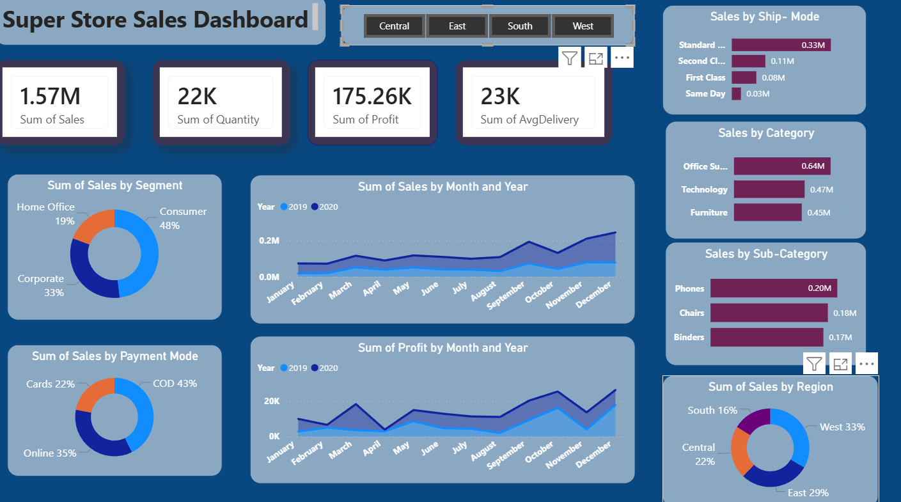

# Super Store Sales Dashboard

## Overview
An interactive Power BI dashboard developed to analyze Super Store sales performance across regions, categories, segments, and shipping modes.

## Tools & Technologies
- Power BI
- Power Query
- DAX
- CSV Dataset

## Key Features
- KPI Cards for Sales, Profit, Quantity, and Average Delivery
- Region-wise Sales Analysis
- Category and Sub-Category Analysis
- Monthly Sales Trend Analysis
- Segment-wise Sales Distribution
- Payment Mode Analysis
- Interactive Filters and Slicers

## Dashboard Insights
- Total Sales: 1.57M
- Total Profit: 175.26K
- Total Quantity Sold: 22K
- Highest Sales Region: West
- Consumer Segment contributes the highest sales share

## Files Included
- `SuperStore_SalesDashboard.pbix` - Power BI Dashboard
- `SuperStore_Sales_Dataset.csv` - Dataset
- Dashboard screenshots

## Dashboard Preview

## How to Use
1. Download the `.pbix` file.
2. Open it using Power BI Desktop.
3. Explore the dashboard using the interactive filters and visuals.
